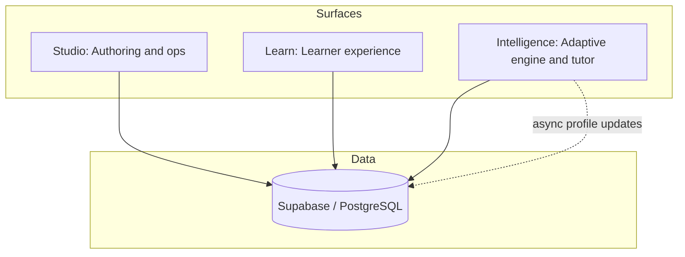
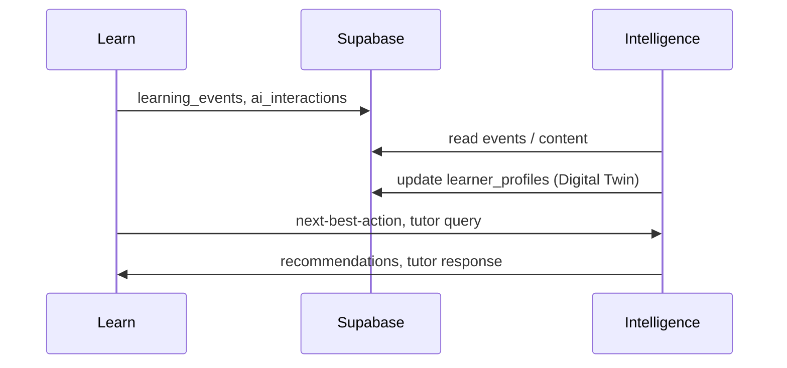

<div align="center">

# Sudar

*Learning that remembers you*

An AI-native learning platform: one reference implementation, and a plugin layer (ALP) so existing LMSs can gain learner memory and adaptive tutoring without full replacement.

**Learns with you, for you.**

</div>
<div>
</div>

---
## What Sudar is

**Sudar** (formerly ByteOS) does two things:

1. **Reference platform** — Authoring (Studio), learner experience (Learn), and intelligence (adaptive engine + AI tutor) over a shared data layer. One place for courses, paths, and a **Digital Learner Twin** that accumulates behaviour, preferences, and tutor context across sessions.
2. **Adaptive Learning Layer (ALP)** — A plugin architecture so you can attach learner memory, memory-aware tutoring, and modality choice to Moodle, Canvas, or other LMSs you already run. No full migration.

Most LMSs deliver the same content to everyone and don’t remember the learner. Research shows adaptive instruction and intelligent tutoring beat one-size-fits-all, but mainstream products don’t keep a longitudinal learner model or offer tutoring that persists across sessions. Sudar is built to close that gap: open source (MIT), with design choices grounded in learning-science evidence ([RESEARCH_FOUNDATION.md](./RESEARCH_FOUNDATION.md)).

---

## What makes it different

| | Sudar + ALP | Typical LMS + AI |
|--|-------------|------------------|
| **Learner model** | Longitudinal (Digital Twin) | None or stateless |
| **Tutor memory** | Cross-session, cross-course | Stateless |
| **Modalities** | Text, video, audio, mindmap, flashcards, feed, game | Usually text/video only |
| **Augment existing LMS** | Yes (ALP plugins) | N/A |
| **Open source** | Yes (MIT) | Rarely |

- **Tutor that remembers** — The AI tutor (Sudar) uses your learner profile and past interactions so it can reference what you struggled with, match your style, and connect new material to what you already know. Details: [docs/sudar-memory.md](./docs/sudar-memory.md).
- **Adaptive paths** — Next-best-action, struggle detection from quizzes, and optional course ordering adapted to the learner.
- **One authoring flow, many formats** — Content is authored once; delivery can be text, video, audio, mindmap, flashcards, and more (text and flashcards are in; others in progress).
- **Paths, compliance, certs** — Assign paths with due dates, see overdue/at-risk/on-track, and issue shareable certificates.

---

## Architecture

Three surfaces, one data layer (as in the [LAMP paper](https://github.com/Dhanikesh-Karunanithi/Sudar)):



- **Studio** (port 3000) — Create courses and paths, assign learners, set due dates, analytics and compliance.
- **Learn** (port 3001) — Enrol in courses and paths, learn with the Sudar tutor, track progress, earn certificates.
- **Intelligence** (port 8000) — Adaptive engine, AI tutor, next-best-action, modality dispatch. Optional Python FastAPI service; core flows can also use direct AI calls from Studio/Learn.

All three share **Supabase** (PostgreSQL, auth, storage) for profiles, content, and events. Learner actions and tutor exchanges write to `learning_events` and `ai_interactions`; Intelligence updates the Digital Learner Twin asynchronously.

---

## Data flow (high level)



---

## Screenshots

Screenshots (dashboard, course viewer with Sudar, Studio paths/compliance) are in [docs/screenshots/](./docs/screenshots/). More will be added as we ship.

---

## Research and evidence

The design is informed by work on adaptive instruction, multimodal learning, self-regulated learning, formative assessment, and learner modelling. Each capability is mapped to references in [RESEARCH_FOUNDATION.md](./RESEARCH_FOUNDATION.md). We encourage use in research and ask that you cite the repo when you do.

---

## Project structure

```
Sudar/
├── README.md
├── RESEARCH_FOUNDATION.md
├── ECOSYSTEM.md              ← Schema, phases, architecture (contributors)
├── AGENTS.md                 ← Instructions for AI coding agents
├── docs/
│   ├── PRD.md, STRATEGIC_PATH.md, ACTION_PLANS.md
│   ├── PRODUCT_FEATURES.md, USER_PERSONAS.md, USER_FLOWS.md
│   └── sudar-memory.md       ← How tutor memory works
├── byteos-studio/             ← Studio (Next.js 14) — port 3000
├── byteos-learn/              ← Learn (Next.js 14) — port 3001
├── byteos-intelligence/      ← Intelligence (Python FastAPI) — port 8000
└── byteos-video/              ← Video generation (optional)
```

---

## Quick start

**Prerequisites:** Node.js 18+, a [Supabase](https://supabase.com) project, and at least one AI provider key (e.g. [Together AI](https://together.ai)).

```bash
git clone https://github.com/Dhanikesh-Karunanithi/Sudar.git
cd Sudar
```

1. **Supabase** — Create a project, run schema/migrations from `ECOSYSTEM.md` (or your Prisma schema), and note project URL, anon key, and service role key.
2. **Studio** — `cd byteos-studio`, copy `.env.example` to `.env.local`, set Supabase and AI keys, then `npm install`, `npx prisma db push`, `npm run dev` → http://localhost:3000.
3. **Learn** — `cd byteos-learn`, same Supabase keys in `.env.local`, `npm install`, `npm run dev` → http://localhost:3001.
4. **Intelligence** (optional) — `cd byteos-intelligence`, `pip install -r requirements.txt`, configure `.env`, `uvicorn src.api.main:app --reload --port 8000`.

---

## Features (summary)

| Area | Capabilities |
|------|--------------|
| **Authoring** | AI course generation, markdown, paths with mandatory/optional and unlock rules, assign learners and due dates. |
| **Learning** | Dashboard (streaks, progress), course viewer with Sudar tutor (RAG + memory), quizzes, learning paths, certificates. |
| **Intelligence** | Next-best-action, struggle detection, adaptive path ordering, personalised welcome. |
| **Compliance** | Assignments, due dates, overdue/at-risk/on-track view, shareable certificate links. |

Full spec: [docs/PRODUCT_FEATURES.md](./docs/PRODUCT_FEATURES.md).

---

## Tech stack

| Layer | Technology |
|-------|------------|
| Studio & Learn | Next.js 14 (App Router), TypeScript, Tailwind |
| Data | Supabase (PostgreSQL); Prisma in Studio |
| Auth | Supabase Auth |
| AI | Together AI (primary), OpenAI / Anthropic (fallback) |
| Intelligence | Python FastAPI (optional) |

---

## Docs and updates

- [UPDATES.md](./UPDATES.md) — What’s built and what’s next; updated as we ship.
- [ECOSYSTEM.md](./ECOSYSTEM.md) — Architecture and schema; read first if you contribute.
- [RESEARCH_FOUNDATION.md](./RESEARCH_FOUNDATION.md) — Evidence base and citation.
- [docs/sudar-memory.md](./docs/sudar-memory.md) — How the tutor’s longitudinal memory works.

---

## Contributing

Contributions that fit the goal of evidence-informed, personalised learning are welcome. Read [ECOSYSTEM.md](./ECOSYSTEM.md) and [AGENTS.md](./AGENTS.md) before large changes. Fork, branch, change, and open a PR with a clear description.

---

## License and citation

**License:** MIT. See [LICENSE](./LICENSE).

**Citation:** If you use Sudar in research or derivative work, please cite:

```bibtex
@software{sudar2026,
  author       = {Karunanithi, Dhanikesh and Sudar Contributors},
  title        = {Sudar: An AI-Native Learning Operating System},
  year         = {2026},
  url          = {https://github.com/Dhanikesh-Karunanithi/Sudar},
  note         = {Reference platform and ALP plugin layer for adaptive, memory-aware learning. Formerly ByteOS. Research foundation: RESEARCH_FOUNDATION.md}
}
```

---

## Origin and creator

Sudar grew out of the ByteAI/ByteVerse line of work: authoring tools, LMS prototypes, AI tutors, and adaptive engines. **Dhanikesh "Dhani" Karunanithi** is the creator. The aim is a single open platform and plugin layer so learning can remember the learner and adapt—both as a standalone product and on top of the LMSs organisations already use.

<p align="center">
  <strong>Sudar</strong> — Learns with you, for you.
</p>

<p align="center">
  <sub>2026 · Open source · MIT</sub>
</p>
